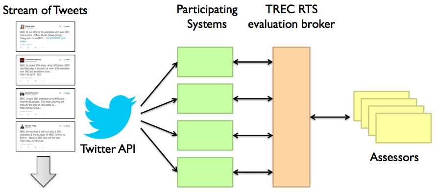

# TREC 2016 Evaluation Guidelines

## Overview

The TREC 2016 Real-Time Summarization evaluation will take place
from August 2, 2016 00:00:00 UTC to August 11, 2016 23:59:59
UTC. During this time, all participating systems will "listen" to the
Twitter sample stream using the Twitter streaming API and perform the
evaluation tasks (described in this document) *in real time*. 
The Twitter streaming API offers an
approximately 1% sample of all tweets (sometimes called the
"spritzer") and is freely available to all registered users. Note that
the evaluation time period is in UTC; participants are
responsible for translating UTC into their local time to align with
the evaluation start and end times.

During the evaluation period, participants will monitor the Twitter
sample stream with respect to a number of "interest profiles", which
are similar to topics in *ad hoc* retrieval, representing users'
information needs. We use "topic" and "interest profile"
interchangeably.

We consider two scenarios:

**Scenario A (push notifications).** In this scenario, content that is
identified as relevant by a system based on the user's interest
profile *in real-time* will be pushed to the TREC RTS evaluation
broker via a REST API (detailed below). These notifications will be
immediately routed to the mobile phones of a group of human assessors.
The scenario A evaluation setup looks like this:

<center></center>

More details about the evaluation platform can be found in a
SIGIR 2016 demo by Roegiest et al., ["A Platform for
Streaming Push Notifications to Mobile
Assessors"](https://cs.uwaterloo.ca/~jimmylin/publications/Roegiest_etal_SIGIR2016.pdf).

At a high level, push notifications should be relevant (on topic),
timely (provide updates as soon after the actual event occurrence as
possible), and novel (users should not be pushed multiple
notifications that say the same thing).

**Scenario B (email digest).** In this scenario, a system will
identify a batch of up to 100 ranked tweets per day per interest
profile. All tweets from 00:00:00 to 23:59:59 are valid candidates for
a particular day. It is expected that systems will compute the results
in a relatively short amount of time after the day ends (e.g., at most
a few hours), but this constraint will not be enforced.
However, participants are not allowed to use future evidence
in generating the ranked lists (e.g., term statistics from the following day).
The final submission (ranked lists of tweets for all days in the evaluation
period) will be uploaded to NIST after the evaluation period ends.

At a high level, these results should be relevant and novel;
timeliness is not important as long as the tweets were all posted on
the previous day.

**IMPORTANT NOTE:** During the evaluation period, track participants
*must* maintain a running system that continuously monitors the tweet
sample stream. The track organizers will provide boilerplate code and
reference baselines, but it is the responsibility of each individual
team to run their systems (and cope with crashes, network glitches,
power outages, etc.). A starting point for
crawling the Twitter sample stream can be found
[here](https://github.com/lintool/twitter-tools/wiki/Sampling-the-public-Twitter-stream).

## Run Types

Each team will be allowed to submit up to three runs for scenario A
and three runs for scenario B. For scenario A, this means that each
team cannot have more than three active client ids with which the REST
API is invoked (during the evaluation period).

Runs for either scenario A or scenario B are categorized into three
different types based on the degree of human involvement:

+ **Automatic Runs**: In this condition, the system must operate
without human intervention before and during the evaluation period. It
is acceptable for a system to perform processing on the interest
profiles (for example, query expansion) before the evaluation period,
but such processing cannot involve human input (e.g., to judge the
quality of the feedback terms). Similarly, systems are allowed to use
training data from the TREC 2015 interest profiles as long as the
training procedure does not involve human input.

+ **Manual Preparation**: In this condition, the system must operate
without human input during the evaluation period, but human
involvement is acceptable before the evaluation period (i.e., after
downloading the interest profiles). Examples of manual preparation
include human examination of the interest profiles to add query
expansion terms or manual relevance assessment on a related collection
to train a classifier. However, once the evaluation period begins, no
further human involvement is permissible.
In this condition, systems are allowed to use training data from the
TREC 2015 interest profiles in any way, including human input,
as long as the human involvement ceases before the beginning of the
evaluation period.

+ **Manual Intervention**: In this condition, there are no limitations
on human involvement before or during the evaluation
period. Crowd-sourcing judgments, human-in-the-loop search, etc. are
all acceptable.

For scenario A, we will ask each participant for the run type of each
run (client id). For scenario B, when uploading a run, each
participant will be asked to designate its type. All types of systems
are welcomed; in particular, manual preparation and manual
intervention runs will help us understand human performance on this
task and enrich the judgment pool.

## Interest Profiles

An interest profile is a JSON-formatted structure that contains the
same information as a "traditional" *ad hoc* topic:

```
  { "topid" : "MB246",
    "title" : "Greek international debt crisis",
    "description" : "Find information related to the crisis surrounding the Greek debt to international creditors, and the consequences of their possible withdrawal from the European Union.",
    "narrative" : "Given the continuing crisis over the Greek debt to international creditors, such as the International Monetary Fund (IMF), European Central Bank (ECB), and the European Commission, the user is interested in information on how this debt is being handled, including the possible withdrawal of Greece from the euro zone, and the consequences of such a move."
  }
```

The "title" contains a short description of the information need,
similar to what users would type into a search engine. The
"description" and "narrative" are sentence- and paragraph-long
elaborations of the information need, respectively.

For 2016, the interest profiles for evaluation are drawn from three
sources:

1. [Interest profiles that were assessed from TREC 2015](TREC2015-MB-eval-topics.json) (51 of these) - so participants have training data.

2. [Additional interest profiles culled from TREC 2015](TREC2015-MB-noeval-topics-culled.json) (107 of these) - we've gone through manually and retained profiles that are still applicable (e.g., throwing away profiles about events that have happened already) and profiles for which we hope to get a reasonable volume of relevant tweets. 

3. New interest profiles developed for TREC 2016. (Available mid-July)

The official list of interest profiles is provided using a [REST API
call](https://github.com/trecrts/trecrts-eval/tree/master/trecrts-server)
`GET /topics/:clientid` to the RTS evaluation broker. The API provides
a JSON list of interest profiles in the above schema.

The organizers may add interest profiles during the evaluation period,
in response to emerging events of interest. However, additional
interest profiles will not become "active" (i.e., they will not be
assessed) until the *next* day (in UTC). While this is not totally
realistic, as a user would want to begin tracking an interest profile
immediately, this design simplifies coordination with participant
systems. We will communicate the addition of new interest profiles
over the participant's mailing list, but it is the responsibility of
each system to periodically poll the TREC RTS evaluation broker for
the list of topics. However, please do not poll the API for topics
more than once every hour.

In case there are any inconsistencies, the RTS evaluation broker
contains the source of truth for interest profiles.

Note that the RTS evaluation broker will return more interest profiles
than we intend to evaluate. The interest profiles that will
actually be evaluated depend on a number of factors, including
assessor interest, availability of resources, etc.

## Scenario A: Results Submission via the REST API

A system for scenario A must deliver results in real time to the RTS
evaluation broker. This is accomplished via a [REST
API](https://github.com/trecrts/trecrts-eval/tree/master/trecrts-server).
That is, whenever a tweet is identified as relevant to a particular
interest profile, the system must invoke the following call on the RTS evaluation broker:

```
POST /tweet/:topid/:tweetid/:clientid
```

The broker will record the API invocation time as the time the
notification was pushed.

Each run is only allowed to push up to ten tweets per day per interest
profile. Additional tweets beyond the limit will be rejected by the
RTS evaluation broker.

## Scenario B: Results Submission via Batch Upload to NIST

For scenario B, systems should record the tweets that are submitted
for each interest profile for each day in the evaluation period on
their local machines. These runs will be uploaded in batch to NIST
after the evaluation period ends.

A run for scenario B will identify a batch of up to 100 ranked tweets
per day per interest profile. All tweets from 00:00:00 to 23:59:59 are
valid candidates for a particular day. It is expected that systems
will compute the results in a relatively short amount of time after
the day ends (e.g., at most a few hours), but this constraint will not
be enforced.
However, participants are not allowed to use future evidence
in generating the ranked lists (e.g., term statistics from the following day).

The runs should be formatted as a plain text file, where each line has
the following fields:

```
YYYYMMDD topic_id Q0 tweet_id rank score runtag
```

Basically, this is just the standard TREC format prepended with a date
in format `YYYYMMDD` indicating the date the result was
generated. "Q0" is a verbatim string that is part of legacy TREC
format (i.e., keep it as is). The `rank` field is the rank of the
result, starting with one; `score` is it's score.

This format allows us to easily manipulate the runs and pass to
existing scoring scripts to compute nDCG, MAP, etc. on a per day
basis. Please make sure that rank and score are consistent, i.e., rank
1 has the highest score, rank 2 has the second highest score,
etc. Otherwise, scoring ties will be broken arbitrarily.

We will provide details for how to upload the runs closer to the
evaluation period.

**Important Note:** A run can choose *not* to return any tweets for an
interest profile on a particular day, if the system does not believe that
there are any relevant tweets for that interest profile on that
day. See more details regarding the evaluation metrics below.

## Evaluation: Live User-in-the-Loop Assessments

Scenario A systems will be evaluated in two different ways: The first
is live user-in-the-loop assessments, described in this section. The
second is traditional post hoc batch evaluation, described in the next
section. The first approach is brand new for TREC 2016 and
promises a number of significant advantages over traditional post hoc
batch evaluations because it is able to capture live user
assessments. Evaluating systems using two independent approaches
reduces the risk associated with any new experimental methodology and
will support post hoc analyses for validation purposes.

Note that scenario B systems will only be evaluated using the
traditional post hoc batch evaluation approach.

In live user-in-the-loop assessments, tweets submitted by
participating systems to the RTS evaluation broker will be immediately
routed to the mobile phone of an assessor, where it is rendered as a push
notification containing the text of the tweet and the
corresponding interest profile. The assessor may choose to judge the
tweet immediately, or if it arrives at an inopportune time, to ignore
it. Either way, the tweet is added to a judging queue in a custom app
on the assessor's mobile phone, which the assessor can access at any
time to judge the queue of accumulated tweets. As the assessor judges
tweets, the results are relayed back to the evaluation broker and
recorded.

It is anticipated that the assessors will be students at the
University of Waterloo.

The evaluation framework is modeled after the interleaved approach
proposed by Qian et al. in a SIGIR 2016 paper,
["Interleaved Evaluation for Retrospective Summarization and
Prospective Notification on Document
Streams"](https://cs.uwaterloo.ca/~jimmylin/publications/Qian_etal_SIGIR2016.pdf).

It is expected that assessors will "subscribe" to interest profiles
that they are interested in and that they will receive tweets from
multiple systems in an interleaved manner. The assessor will judge
each tweet as relevant, relevant but redundant (on topic, but contains
information conveyed previously), or not relevant. Note that although
the tweets are rendered as push notifications, there is no guarantee
when the assessor is going to perform the assessment (if at all).

Beyond this general description, it is difficult to provide
additional details, such as the exact "routing algorithm" assigning
system runs to assessors, the number of tweets each assessor will
receive daily, etc. These details will depend on how many assessors we
are able to successfully recruit and how many participating systems
there are in the evaluation. In particular, the latter is not knowable
until just before the evaluation begins, as TREC teams can decide at
the last moment to participate (or to drop out). We will, however,
strive to keep participants updated on the participant's mailing
list.

More details about the live user-in-the-loop assessment platform
deployed for this evaluation can be found in a SIGIR 2016
demo by Roegiest et al., ["A Platform for Streaming Push Notifications
to Mobile Assessors"](https://cs.uwaterloo.ca/~jimmylin/publications/Roegiest_etal_SIGIR2016.pdf).

## Evaluation: Post Hoc Batch Evaluations

In contrast to live user-in-the-loop assessments, the post hoc
batch evaluation methodology has been refined over the past few years and
has been experimentally validated.

The evaluation methodology is based on pooling. A common pool will be
constructed based on scenario A and scenario B submissions. The pool
depth will be determined after the evaluation period has ended by NIST
based on the number of submissions and available resources. The
assessment workflow is as follows: first, tweets returned by the
systems will be assessed for relevance. Tweets will be judged as
not-relevant, relevant, or highly relevant.

Relevant tweets will then be semantically clustered into groups
containing tweets that share substantively similar information. This
evaluation methodology is based on the TREC 2015 Microblog evaluation,
see [overview paper](http://trec.nist.gov/pubs/trec24/papers/Overview-MB.pdf),
which is in turn based on the Tweet Timeline
Generation (TTG) task, see [Wang et al. (SIGIR 2015)](https://dl.acm.org/citation.cfm?id=2767699).

It is anticipated that NIST will perform both the relevance assessment
and the semantic clustering. These outputs serve as inputs to separate
metrics for scenario A and scenario B, detailed below.

### Scenario A

For previous participants, the two main differences between the
metrics this year and the metrics from TREC 2015 are:

1. Treatment of "silent days"

2. Treatment of the latency penalty

In the following, we define metrics used in the evaluation of scenario
A runs. All metrics are computed for each day for each interest
profile and averaged.

**Expected gain (EG)** (for an interest profile on a particular day)
is defined as follows:


where *N* is the number of tweets returned and *G(t)* is the gain of each tweet:

+ Not relevant tweets receive a gain of 0.
+ Relevant tweets receive a gain of 0.5.
+ Highly-relevant tweets receive a gain of 1.0.

Once a tweet from a cluster is retrieved, all other tweets from the
same cluster automatically become not relevant. This penalizes systems
for returning redundant information. Note that unlike last year, there
is no latency penalty applied to the gain; the latency is
computed separately (see below).

**Normalized Cumulative Gain (nCG)** (for an interest profile on a
particular day) is defined as follows:


where *Z* is the maximum possible gain (given the ten tweet per day
limit). The gain of each individual tweet is computed as above. Also,
once a tweet from a cluster is retrieved, all other tweets from the
same cluster automatically become not relevant. Note that unlike last
year, there is no latency penalty applied to the gain; the latency is
computed separately (see below).

An interesting question is how scores should be computed for days in
which there are no relevant tweets: for rhetorical convenience, we call
days in which there are no relevant tweets for a particular interest
profile (in the pool) "silent days", in contrast to "eventful days"
(where there are relevant tweets). In the EG-1 and nCG-1 variants of
the metrics, on a "silent day", the system receives a score of one
(i.e., perfect score) if it does not push any tweets, or zero
otherwise. In the EG-0 and nCG-0 variants of the metrics, for a silent
day, all systems receive a gain of zero no matter what they do.
For more details, see a [SIGIR 2016 paper by Tan et al.](https://cs.uwaterloo.ca/~jimmylin/publications/Tan_etal_SIGIR2016a.pdf)
that explores these variant metrics.

That is, under EG-1 and nCG-1, systems are rewarded for recognizing
that there are no relevant tweets for an interest profile on a
particular day, and remaining silent (i.e., does not push any
tweets). The EG-0 and nCG-0 variants of the metrics do not reward
recognizing silent days: that is, it never hurts to push tweets.

**Gain Minus Pain (GMP)** is defined as follows:


The *G* (gain) is computed in the same manner as above; *P* (pain) is
the number of non-relevant tweets that are pushed, and &#945; controls
the balance between the two. We propose three &#945; settings: 0.33,
0.5, and 0.66.

Thus for scenario A, we will report EG-1, EG-0, nCG-1, nCG-0, and
GMP (with different &#945; settings). EG-1 will be considered the primary metric; it will be used as
the sort key when reporting results in the track overview paper.

**Latency.** The TREC 2015 Microblog and Temporal Summarization
metrics applied a temporal penalty to gain. The issue with this
approach is that we have no empirical evidence as to what the "human
response curve" to latency looks like. For example, how much do users
care about the lateness of the push notification? Instead of applying
an arbitrary latency penalty, we have decided to explicitly report the
latency separately. Thus, in addition to the EG-1, EG-0, nCG-1, nCG-0,
and GMP scores, we will report, *only* for tweets that contribute to
gain, the mean and median difference between the time the tweet was
pushed and the first tweet in the semantic cluster that the tweet
belongs.

For example, suppose tweet A, B, and C are in the same semantic
cluster, and were posted 09:00, 10:00, and 11:30, respectively. No
matter which of the three tweets is pushed, the latency is computed
with respect to the creation time of A (09:00). Therefore, pushing
tweet C at 11:30 and pushing tweet A at 11:30 gives the same latency.

Separately reporting gain and latency will allow participants to
explicitly model tradeoffs between the two factors.

### Scenario B

For scenario B runs, we compute the nDCG@10 score for each day for
each interest profile, and then average across them. As with the
scenario A metrics, we will measure two variants: nDCG@10-1,
nDCG@10-0. In nDCG@10-1, on a "silent day" (same definition as above),
the system receives a score of one (i.e., perfect score) if it does
not return any tweets (i.e., does not submit a ranked list for that
interest profile), or zero otherwise. In nDCG@10-0, for a silent day,
all systems receive a gain of zero no matter what they do.

Just as in scenario A, nDCG@10-1 rewards a system for recognizing when
there are no relevant tweets, whereas for nDCG@10-0, it never hurts to
return tweets, even if there are no relevant tweets for that day.

